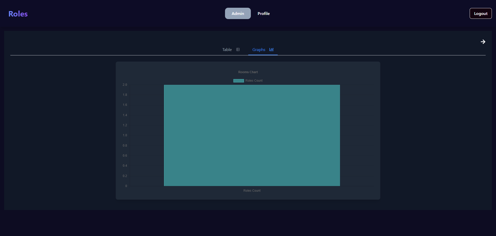

# Collaboration Code Editor

This project implements code editor that each user that is signed up and logged in can share. there is also admin dashboard for managing code rooms,users and roles.

## Table of Contents

- [Project Overview](#project-overview)
- [Architecture Design](#architecture-design)
- [Technologies Used](#technologies-used)
- [Installation](#installation)
- [Screenshots](#screenshots)

## Project Overview

The <b> Collaboration Code Editor </b> is a web-based platform that allows users to collaboratively write, edit, and manage code in real time. The platform provides features such as code sharing, syntax highlighting, and live updates, making it an ideal tool for developers working in teams or conducting coding interviews. Users can sign up, log in, and create or join code rooms to collaborate seamlessly. Additionally, the platform includes an admin dashboard where administrators can manage code rooms, users, and their roles efficiently. This project aims to foster collaboration, enhance productivity, and streamline team workflows by providing an intuitive and interactive coding environment.

## Architecture Design

## Technologies Used

| **Technology**     | **Logo**                                                                                                                                                                      |
| ------------------ | ----------------------------------------------------------------------------------------------------------------------------------------------------------------------------- |
| **Docker**         |                                                       |
| **Docker Compose** |                                          |
| **React**          |                                                                         |
| **Redux**          |                                                                                    |
| **TailwindCSS**    |  |
| **TypeScript**     |  |
| **NodeJS**         |                                          |
| **ExpressJS**      |                                                             |
| **SocketIO**       |                                                   |

## Installation

Clone the repository and ensure you have the latest NodeJS and VSCODE MongoDB Compass (if you want to use mongodb locally) installed on your machine.

- <b> git clone </b> https://github.com/roy845/Code-Collaboration-Editor.git

<b> Client </b>

<b>1.</b> Type the command <b> cd client </b> in the terminal to change to client directory.
<b>2.</b> Type <b> npm install </b> <b> OR </b> <b> npm i </b> (for short) in the terminal to install the project dependecies.
<b>3.</b> Type <b> npm start </b> to start the local development server.

<b> Server </b>

<b>1.</b> Type the command <b> cd server </b> in the terminal to change to server directory.
<b>2.</b> Create <b> .env </b> file at the root of the server directory with these fields:

<b> PORT=
MONGO_INITDB_ROOT_USERNAME=
MONGO_INITDB_ROOT_PASSWORD=
MONGO_URL=
JWT_SECRET=
JWT_EXPIRES_IN=
JWT_REFRESH_TOKEN_EXPIRES_IN=
EMAIL_USERNAME=
EMAIL_PASSWORD= </b>

<b>3.</b> Type the command <b> npm install </b> <b> OR </b> <b> npm i </b> (for short) in the terminal to install the project dependecies.
<b>4.</b> Type the command <b> docker-compose up -d </b> in the terminal to run the MongoDB container in detached mode.
<b>5.</b> Type npm <b> run dev </b> to start the local development server.

## Screenshots

<b> Auth </b>

<b> Login Page </b>

<b> Register Page </b>

<b> Forgot Password Page </b>

<b> Reset Password Page </b>

<b> Home (Join/Create Room) </b>

<b> Code Editor </b>

<b> Profile </b>

<b> Admin </b>

<b> Admin/Rooms </b>

<b> Admin/Rooms Graph Count </b>

<b> Admin/Room Details </b>

<b> Admin/Users </b>

<b> Admin/Users Graph Count </b>

<b> Admin/User Details </b>

<b> Admin/Roles </b>

<b> Admin/Roles Graph Count </b>

<b> Admin/Role Details </b>

<b> Admin/Create new Role </b>

